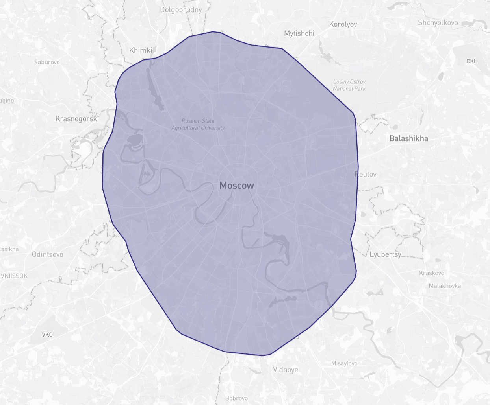
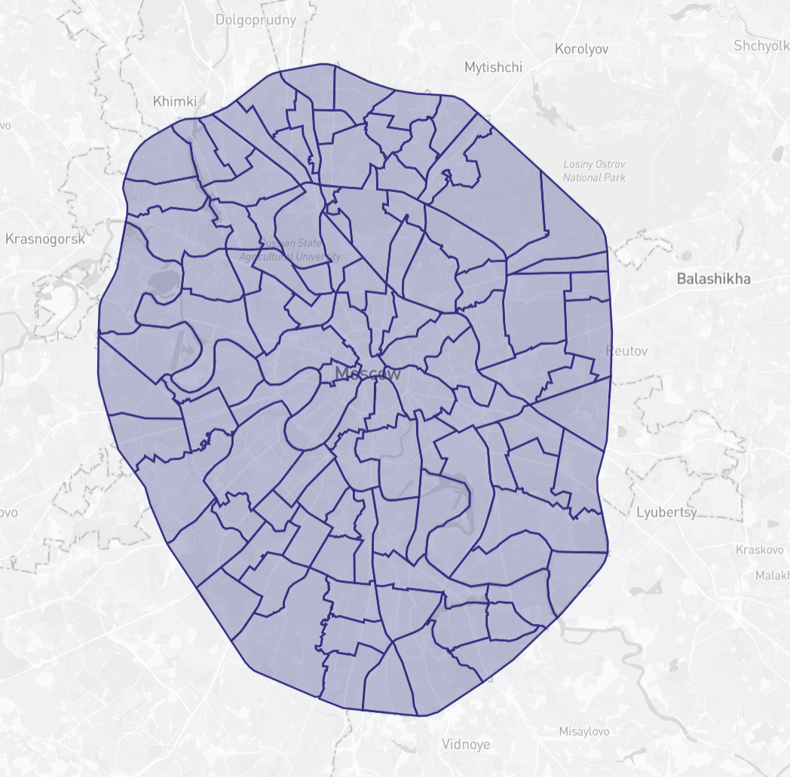

# Moscow Geo



Moscow Geo - это набор GeoJSON файлов с районами Москвы, границей МКАД и готовым результатом обрезки районов по МКАД.

Репозиторий можно использовать как источник геоданных для карт, визуализаций, фильтрации объектов внутри МКАД и простых геометрических расчетов.



На первом изображении показана область МКАД. На втором изображении показаны районы Москвы, отобранные и обрезанные по этой области.

## Содержимое

В репозитории есть:

- исходные районы Москвы в GeoJSON
- геометрия МКАД в GeoJSON
- облегченная геометрия МКАД
- готовый файл с районами внутри МКАД
- Python скрипт для повторной генерации результата

## Структура проекта

```text
.
|-- LICENSE
|-- README.md
|-- districts_in_mkad.geojson
|-- example1.png
|-- example2.png
|-- low_resolution_mkad.geojson
|-- mkad.geojson
|-- mkad_district_filter.py
`-- moscow_districts.geojson
```

| Файл | Назначение |
|---|---|
| `moscow_districts.geojson` | Исходные районы Москвы в GeoJSON. |
| `mkad.geojson` | Геометрия МКАД в GeoJSON. |
| `low_resolution_mkad.geojson` | Облегченная геометрия МКАД для быстрых карт и превью. |
| `districts_in_mkad.geojson` | Районы Москвы, отобранные и обрезанные по границе МКАД. |
| `mkad_district_filter.py` | Скрипт для отбора и обрезки районов по МКАД. |
| `example1.png` | Пример отображения границы МКАД. |
| `example2.png` | Пример отображения районов внутри МКАД. |
| `LICENSE` | Лицензия проекта. |

## Что делает скрипт

`mkad_district_filter.py` берет два входных GeoJSON файла:

```text
moscow_districts.geojson
mkad.geojson
```

И создает выходной файл:

```text
districts_in_mkad.geojson
```

По умолчанию скрипт:

1. читает геометрию районов Москвы
1. читает геометрию МКАД
1. переводит геометрию из EPSG:4326 в EPSG:3857 для расчетов в метрах
1. проверяет, какие районы попадают внутрь МКАД
1. оставляет районы, у которых достаточно площади внутри МКАД
1. обрезает геометрию районов по границе МКАД
1. упрощает результат
1. записывает итоговый GeoJSON

Район остается в результате, если выполняется одно из условий:

- не меньше заданной доли площади района находится внутри МКАД
- representative point района находится внутри МКАД

Порог площади по умолчанию:

```text
0.1
```

То есть район остается, если не меньше 10% его площади попадает внутрь МКАД.

## Зависимости

Нужен Python 3 и пакеты:

```text
shapely
pyproj
```

Установка через pip:

```sh
python3 -m pip install shapely pyproj
```

На Arch Linux:

```sh
sudo pacman -S python python-pip
python3 -m pip install shapely pyproj
```

## Быстрый запуск

Сгенерировать districts_in_mkad.geojson:

```sh
python3 mkad_district_filter.py moscow_districts.geojson mkad.geojson
```

По умолчанию результат будет записан в:

```text
districts_in_mkad.geojson
```

То же самое с явным выходным файлом:

```sh
python3 mkad_district_filter.py moscow_districts.geojson mkad.geojson districts_in_mkad.geojson
```

Если у файла есть право на выполнение, можно запускать так:

```sh
./mkad_district_filter.py moscow_districts.geojson mkad.geojson
```

## Режим без обрезки

Обычный режим режет геометрию районов по МКАД.

Если нужно только отобрать районы, но оставить их исходную геометрию целиком:

```sh
python3 mkad_district_filter.py moscow_districts.geojson mkad.geojson --no-clip
```

Этот режим может оставить части районов за пределами МКАД, если исходная геометрия района содержит такие полигоны.

## Основные параметры

| Параметр | Значение |
|---|---|
| `--no-clip` | Не обрезать геометрию по МКАД, оставить исходные полигоны районов. |
| `--keep-properties` | Сохранить свойства исходных районов в выходном GeoJSON. |
| `--min-ratio N` | Минимальная доля площади района внутри МКАД. По умолчанию: `0.1`. |
| `--simplify-m N` | Упростить геометрию в метрах в EPSG:3857. По умолчанию: `60`. |
| `--buffer-m N` | Добавить буфер к геометрии МКАД перед фильтрацией. По умолчанию: `0`. |

## Примеры

Обрезать районы по МКАД:

```sh
python3 mkad_district_filter.py moscow_districts.geojson mkad.geojson
```

Обрезать районы по МКАД и явно указать выходной файл:

```sh
python3 mkad_district_filter.py moscow_districts.geojson mkad.geojson districts_in_mkad.geojson
```

Оставить исходную геометрию районов без обрезки:

```sh
python3 mkad_district_filter.py moscow_districts.geojson mkad.geojson --no-clip
```

Сохранить свойства районов:

```sh
python3 mkad_district_filter.py moscow_districts.geojson mkad.geojson districts_in_mkad.geojson --keep-properties
```

Изменить порог площади:

```sh
python3 mkad_district_filter.py moscow_districts.geojson mkad.geojson districts_in_mkad.geojson --min-ratio 0.2
```

Отключить упрощение геометрии:

```sh
python3 mkad_district_filter.py moscow_districts.geojson mkad.geojson districts_in_mkad.geojson --simplify-m 0
```

Добавить буфер к МКАД перед фильтрацией:

```sh
python3 mkad_district_filter.py moscow_districts.geojson mkad.geojson districts_in_mkad.geojson --buffer-m 100
```

## Проверка GeoJSON

Проверить, сколько объектов в готовом файле:

```sh
jq '.features | length' districts_in_mkad.geojson
```

Посмотреть тип GeoJSON:

```sh
jq -r '.type' districts_in_mkad.geojson
```

Проверить, что файл является FeatureCollection:

```sh
jq -e '.type == "FeatureCollection"' districts_in_mkad.geojson
```

## Система координат

Входные GeoJSON файлы хранятся в EPSG:4326.

Для расчетов площади, буфера и упрощения скрипт временно переводит геометрию в EPSG:3857. После обработки результат снова записывается в EPSG:4326.

Это нужно, чтобы параметры вроде `--simplify-m` и `--buffer-m` задавались в метрах.

## Лицензия

Проект распространяется под лицензией GNU Affero General Public License v3.0. Подробности смотрите в файле LICENSE.
